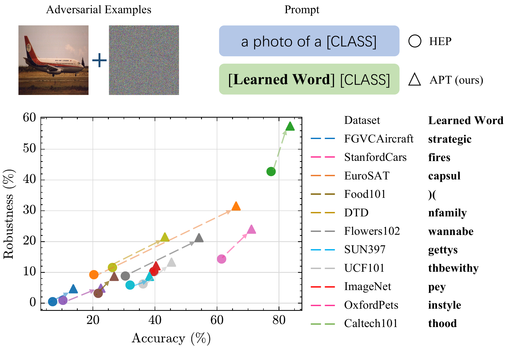

# APT: Adversarial Prompt Tuning
The official code of the paper "One Prompt Word is Enough to Boost Adversarial Robustness for Pre-trained Vision-Language Models" which is accepted by the main conference of CVPR 2024. 

**Abstract:** Large pre-trained Vision-Language Models (VLMs) like CLIP, despite having remarkable generalization ability, are highly vulnerable to adversarial examples. This work studies the adversarial robustness of VLMs from the novel perspective of the text prompt instead of the extensively studied model weights (frozen in this work). We first show that **the effectiveness of both adversarial attack and defense are sensitive to the used text prompt**. Inspired by this, we **propose a method to improve resilience to adversarial attacks by learning a robust text prompt for VLMs**. The proposed method, named Adversarial Prompt Tuning (APT), is effective while being both computationally and data efficient. Extensive experiments are conducted across 15 datasets and 4 data sparsity schemes (from 1-shot to full training data settings) to show APT's superiority over hand-engineered prompts and other state-of-the-art adaption methods. APT demonstrated excellent abilities in terms of the in-distribution performance and the generalization under input distribution shift and across datasets. Surprisingly, by simply adding one learned word to the prompts, APT can significantly boost the accuracy and robustness ($\epsilon=4/255$) over the hand-engineered prompts by +13\% and +8.5\% on average respectively. The improvement further increases, in our most effective setting, to +26.4\% for accuracy and +16.7\% for robustness.

Arxiv: https://arxiv.org/abs/2403.01849.



## Preparation

### Code

This code is built on top of [CoOp](https://github.com/KaiyangZhou/CoOp) which extensively uses the toolbox [Dassl.pytorch](https://github.com/KaiyangZhou/Dassl.pytorch) so you need to install the `dassl` environment first. Simply follow the instructions described [here](https://github.com/KaiyangZhou/Dassl.pytorch#installation) to install `dassl`. After that, run `pip install -r requirements.txt` to install a few more packages (this should be done when `dassl` is activated). Then, you are ready to go.

### Data

Follow [DATASETS.md](DATASETS.md) to install the datasets. After successfully set up the datasets, the data directory variables, `DATA`, in each script under `/apt/scripts` MUST be updated with the root path of those datasets.  

### Pre-trained Robust CLIP Backbone

We adopt as backbone the pre-trained adversarially-robust CLIP models from [TeCoA](https://github.com/cvlab-columbia/ZSRobust4FoundationModel). The used pre-trained weights are provided [here](https://emckclac-my.sharepoint.com/:f:/g/personal/k19010102_kcl_ac_uk/EmZ98eFLv71FqQyqPLvWNTkBYNAKPyx_wYEDjNPx7smKCA?e=8AB51S). To run the code, the pre-trained backbone models should be placed under the directory `/backbone`.  The code currently supports two architectures: ViT-B/32 (named `vitb32`) and ResNet50 (named `rn50`). Taking an example of tuning ViT-B/32 at epsilon=4/255, the path to the checkpoint is `/apt/backbone/vitb32_eps4.pth.tar`. Note that our code can be easily adapted to load other pre-trained models as backbone.

## Adversarial Prompt Tuning

The following command (being executed under the directory `/apt`) runs APT to tune text prompt using an experiment setting specified by `/apt/configs/trainers/APT/vit_b32_ep50.yaml`:

```bash
bash scripts/APT.sh imagenet vit_b32_ep50 end 16 16 False 4 2.67 3 0 onfly 0
```

The above arguments correspond to in order:

1. dataset ID. The list of supported dataset ID is given by the name of dataset source code files under the directory `apt/datasets`.
2. training configuration identifier. For full specification, please refer to the corresponding file. There are other predefined configurations under `apt/configs/trainers/APT`.
3. the position of class token
4. the number of context vectors, `M`
5. the number of shots, `N`, `-1` for tuning with entire training set.
6. the variant of APT: True for Class Specific Context (CSC); False for Unified Context (UC)
7. the training perturbation budget, `\epsilon`
8. the step size of training adversary, `\alpha`
9. the number of steps for training adversary
10. seed of run.
11. the prompting strategy: "perturbed", "constant" and "onfly"
12. the step size, `\alpha`, for perturbing text prompt if prompting strategy "perturbed" used.

### Pre-trained Prompt Weights:

To facilitate reproducibility, the pre-trained text prompt weights are provided [here](https://emckclac-my.sharepoint.com/:f:/g/personal/k19010102_kcl_ac_uk/EmZ98eFLv71FqQyqPLvWNTkBYNAKPyx_wYEDjNPx7smKCA). 

## Adversarial Evaluation

### In-Distribution

The following command evaluates the tuned text prompt against PGD attack on the test set of the same dataset as training:

```bash
python evaluate.py path_to_checkpoint --cls-prompt prompter --attack pgd
```

* Replace the `path_to_checkpoint` with the real path ending by the seed-level directory, e.g.,  `output/imagenet/CoOpAT/vit_b32_ep50_st_16shots/nctx16_cscFalse_ctpend/eps4_alpha2.67_step3/seed0`. 
* By default, the same perturbation budget is used for evaluation as for training which is read from the saved configuration file. 
* `--cls-prompt` specifies the text prompt for classification (inference). By specifying `prompter`, the prompt is loaded from the saved, APT-tuned, weights. Otherwise, a string template is expected, e.g., "`a photo of a {}`" where `{}` is necessary and will be automatically replaced by the real class label.
* `--atk-prompt` specifies the text prompt for attack, i.e., generating adversarial examples. By default, it uses the same prompt as the `--cls-prompt` unless specified otherwise.
* The current code implements 4 adversarial attacks: PGD, TPGD, CW and AutoAttack. They are identified in `--attack` by `pgd`, `tpgd`, `cw` and `aa`, respectively.

The evaluation result will be saved under the provided `path_to_checkpoint` directory in a name of `evaluation.yaml`.

### Zero-shot / Out-Of-Distribution

The following command evaluates the tuned text prompt against PGD attack on the other dataset, OxfordFlowers in this case:

```bash
python evaluate.py path_to_checkpoint --dataset OxfordFlowers --cls-prompt prompter --attack pgd
```

* `--dataset` specifies the target dataset to be evaluated on. Note that the naming of datasets can be found in the corresponding `.yaml` files [here](https://github.com/TreeLLi/APT/tree/main/apt/configs/datasets), which are different from the ones defined [here](#Adversarial Prompt Tuning).

The evaluation result will be saved under the provided `path_to_checkpoint` directory in a name of `dist_shift.yaml`.

## Dependency

The code is heavily built on top of the following projects:

* [CoOp (IJCV 2022)](https://github.com/KaiyangZhou/CoOp)
* [OODRobustBench (ICML2024 and ICLRW-DMLR 2024)](https://github.com/OODRobustBench/OODRobustBench)

We sincerely appreciate their help!

## Citation

```
@inproceedings{li2024apt,
    title={One Prompt Word is Enough to Boost Adversarial Robustness for Pre-trained Vision-Language Models},
    author={Lin Li*, Haoyan Guan*, Jianing Qiu, Michael Spratling},
    booktitle={IEEE/CVF Conference on Computer Vision and Pattern Recognition (CVPR)},
    year={2024}
}
```

